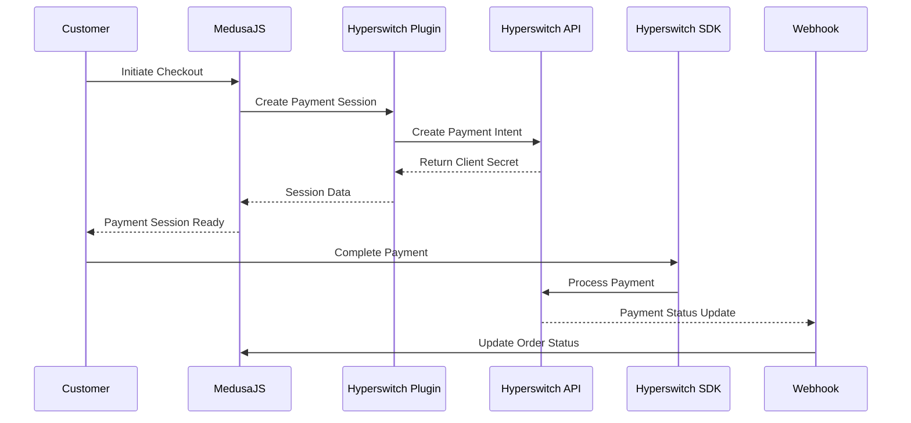

# Medusa Payment Hyperswitch


Hyperswitch payment plugin for MedusaJS - Enable seamless payment processing through multiple payment providers.

## 🏆 $2000 Bounty Submission

This plugin is submitted for the [$2000 MedusaJS Plugin Bounty](https://github.com/juspay/hyperswitch/issues/6007) by Hyperswitch/Juspay.

## Features

- ✅ Full integration with Hyperswitch API
- ✅ Support for multiple payment providers
- ✅ Authorization, capture, refund, and cancellation flows
- ✅ Webhook signature verification
- ✅ Proxy support for secure connections
- ✅ Comprehensive error handling and logging
- ✅ Compatible with latest MedusaJS versions

## Installation

```bash
npm install medusa-payment-hyperswitch
```

or

```bash
yarn add medusa-payment-hyperswitch
```

## Configuration

Add the plugin to your `medusa-config.js`:

```javascript
const plugins = [
  // ...other plugins
  {
    resolve: "medusa-payment-hyperswitch",
    options: {
      api_key: process.env.HYPERSWITCH_API_KEY,
      publishable_key: process.env.HYPERSWITCH_PUBLISHABLE_KEY,
      api_url: "https://api.hyperswitch.io", // Optional, defaults to production URL
      webhook_secret: process.env.HYPERSWITCH_WEBHOOK_SECRET, // Optional
      proxy: { // Optional proxy configuration
        host: "proxy.example.com",
        port: 8080
      }
    }
  }
]
```

## Environment Variables

Add these to your `.env` file:

```env
HYPERSWITCH_API_KEY=your_api_key_here
HYPERSWITCH_PUBLISHABLE_KEY=your_publishable_key_here
HYPERSWITCH_WEBHOOK_SECRET=your_webhook_secret_here
```

## Usage

### Frontend Integration

```javascript
// In your checkout flow
const { cart } = await medusa.carts.createPaymentSessions(cartId)
const hyperswitchSession = cart.payment_sessions.find(
  ps => ps.provider_id === "hyperswitch"
)

// Use the client_secret to complete payment on frontend
const { client_secret, publishable_key } = hyperswitchSession.data
```

### Payment Flow

1. **Create Payment Session**: Automatically created when customer selects Hyperswitch
2. **Authorize Payment**: Process payment using Hyperswitch SDK on frontend
3. **Capture Payment**: Automatically or manually capture authorized payments
4. **Handle Refunds**: Process full or partial refunds through admin panel

## API Reference

### Payment Service Methods

- `createPayment(cart)` - Create a new payment session
- `updatePayment(sessionData, cart)` - Update existing payment
- `deletePayment(payment)` - Cancel/delete payment
- `retrievePayment(paymentData)` - Get payment details
- `getStatus(paymentData)` - Get current payment status
- `capturePayment(payment)` - Capture authorized payment
- `refundPayment(payment, amount)` - Process refund
- `cancelPayment(payment)` - Cancel payment

## Webhook Handling

Add webhook endpoint to receive Hyperswitch notifications:

```javascript
// In your custom API routes
app.post("/hyperswitch/webhooks", async (req, res) => {
  const signature = req.headers["x-hyperswitch-signature"]
  const isValid = hyperswitchService.verifyWebhook(
    JSON.stringify(req.body),
    signature
  )
  
  if (!isValid) {
    return res.status(400).send("Invalid signature")
  }
  
  // Process webhook event
  await processWebhookEvent(req.body)
  res.sendStatus(200)
})
```

## Testing

Run the test suite:

```bash
npm test
```

## Flow Diagram



## Support

- **Documentation**: [Hyperswitch Docs](https://docs.hyperswitch.io)
- **Issues**: [GitHub Issues](https://github.com/Qethys/medusa-payment-hyperswitch/issues)
- **Discord**: [MedusaJS Discord](https://discord.gg/medusajs)

## Contributing

Contributions are welcome! Please read our [Contributing Guide](CONTRIBUTING.md) for details.

## License

MIT License - see [LICENSE](LICENSE) file for details.

## Author

**Qethys** - Building payment solutions for modern commerce

---

## Bounty Information

- **Bounty Amount**: $2000
- **Issue**: [#6007](https://github.com/juspay/hyperswitch/issues/6007)
- **Status**: Submitted for review
- **Payment Address**: `0x958BD67f2f6be2Dc46D0e9e0Dd6d33F52EfCA67C`

---

Made with ❤️ for the MedusaJS and Hyperswitch communities